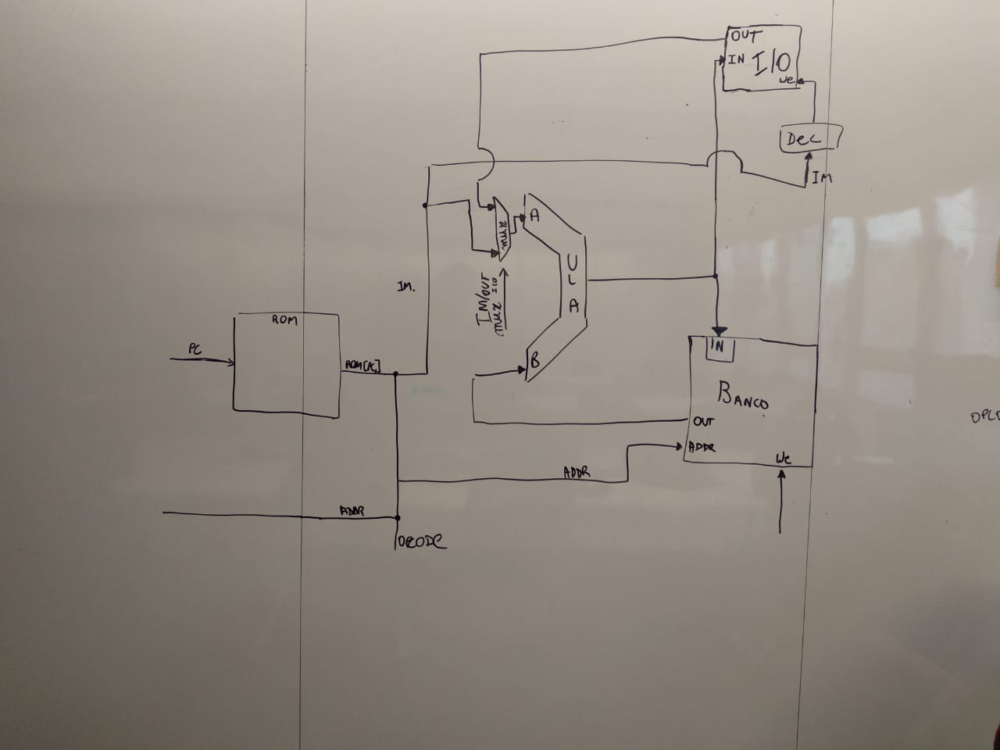
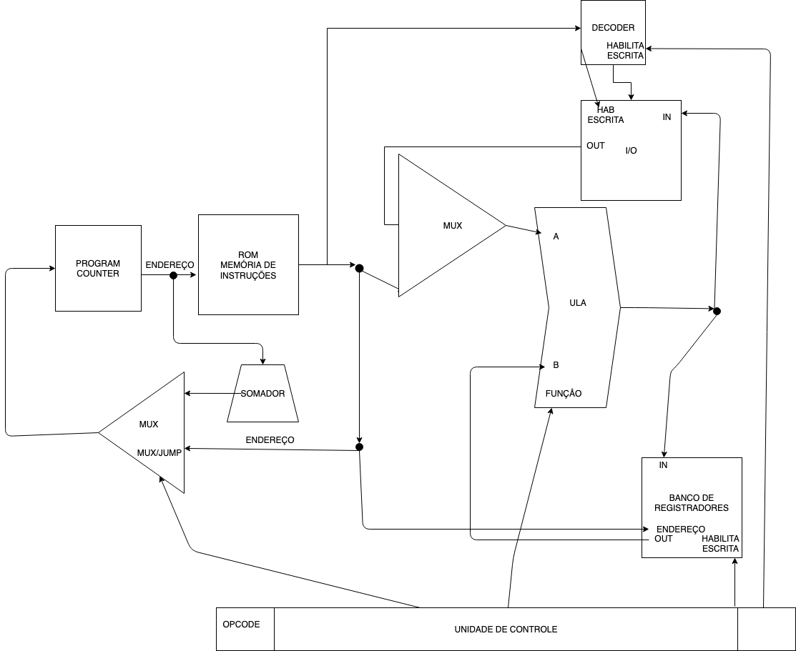

# Processador-Relogio
Design de Computadores sexto semestre. 

Relatório Final

    Assembly do relógio;

    Total de instruções e sua sintaxe;

    Formato das instruções;

    Modos de endereçamento utilizados e mapa de memória.;

    Arquitetura do processador;

    Diagrama de conexão do processador com os periféricos;

    Fluxo de dados para o processador, com uma explicação resumida do seu funcionamento;

    Listagem dos pontos de controle e sua utilização;


`` 1)Código em assembly está nos arquivos relogio2.s  ``


#
*Código assembly do modelo*

```asm
.INIT:
	movr $0, %s1
	movr $0, %s2
	movr $0, %m1
	movr $0, %m2
	movr $0, %h1
	movr $0, %h2
	movd $0, %s1
	movd $1, %s2
	movd $2, %m1
	movd $3, %m2
	movd $4, %h1
	movd $5, %h2
    movd $7, %btempo
    movr $10, %chave1
.CLOCK:
    loadio $6, %btempo
	cmp $1, %btempo 
	je .CLEAR
	cmp $9, %btempo 
	je .AMPM
    jmp .CLOCK
.CLEAR:
    movd $7, %btempo 
    movr $0, %chave1
    movd $12, %chave1
.SEGUNDOS:
    add $1, %s1
    cmp $10, %s1
    je .S2
    jmp .DISPLAY
.S2:
    movr $0, %s1
    add $1, %s2
    cmp $6, %s2
    je .M1
    jmp .DISPLAY
.M1:
    movr $0, %s2
    add $1, %m1
    cmp $10, %m1
    je .M2
    jmp .DISPLAY
.M2:
    movr $0, %m1
    add $1, %m2
    cmp $6, %m2
    je .H1
    jmp .DISPLAY

.H1:
    movr $0, %m2
    add $1, %h1
    cmp $4, %h1
    je .CHECK
    cmp $10, %h1
    je .H2
    jmp .DISPLAY
.CHECK:
    cmp $2, %h2
    je .VOLTA
    jmp .DISPLAY
.H2:
    movr $0, %h1
    add $1, %h2
    jmp .DISPLAY
.VOLTA:
    movr $0, %s1
    movr $0, %s2
    movr $0, %m1
    movr $0, %m2
    movr $0, %h1
    movr $0, %h2
    jmp .DISPLAY
.DISPLAY:
	movd $0, %s1
	movd $1, %s2
	movd $2, %m1
	movd $3, %m2
	movd $4, %h1
	movd $5, %h2
    jmp .CLOCK
.AMPM:
.CLEAR2:
    movd $7, %btempo
.CORRECT:
    cmp $1, %h2
    je .CHECK3
    cmp $2, %h2
    je .CHECK4
.SEGUNDOS2:
    movd $12, %chave1
    add $1, %s1
    cmp $10, %s1
    je .S22
    jmp .DISPLAY2
.S22:
    movr $0, %s1
    add $1, %s2
    cmp $6, %s2
    je .M12
    jmp .DISPLAY2
.M12:
    movr $0, %s2
    add $1, %m1
    cmp $10, %m1
    je .M22
    jmp .DISPLAY2
.M22:
    movr $0, %m1
    add $1, %m2
    cmp $6, %m2
    je .H12
    jmp .DISPLAY2

.H12:
    movr $0, %m2
    add $1, %h1
    cmp $3, %h1
    je .CHECK2
    cmp $10, %h1
    je .H22
    jmp .DISPLAY2
.CHECK2:
    cmp $1, %h2
    je .VOLTA2
    jmp .DISPLAY2
.H22:
    movr $0, %h1
    add $1, %h2
    jmp .DISPLAY2
.VOLTA2:
    movr $0, %s1
    movr $0, %s2
    movr $0, %m1
    movr $0, %m2
    movr $1, %h1
    movr $0, %h2
    cmp $10, %chave1
    je .TROCAP
    movr $10, %chave1
    movd $12, %chave1
    jmp .DISPLAY2
.TROCAP:
    movr $11, %chave1
    movd $12, %chave1
    jmp .DISPLAY2
.DISPLAY2:
	movd $0, %s1
	movd $1, %s2
	movd $2, %m1
	movd $3, %m2
	movd $4, %h1
	movd $5, %h2
    jmp .CLOCK
.CHECK3:
    cmp $3, %h1
    je .L13
    cmp $4, %h1
    je .L14
    cmp $5, %h1
    je .L15
    cmp $6, %h1
    je .L16
    cmp $7, %h1
    je .L17
    cmp $8, %h1
    je .L18
    cmp $9, %h1
    je .L19
    jmp .SEGUNDOS2
.CHECK4:
    cmp $0, %h1
    je .L20
    cmp $1, %h1
    je .L21
    cmp $2, %h1
    je .L22
    cmp $3, %h1
    je .L23
    cmp $4, %h1
    je .L24
    jmp .SEGUNDOS2
.L13:
    movr $0, %h2
    movr $1, %h1
    jmp .SEGUNDOS2
.L14:
    movr $0, %h2
    movr $2, %h1
    jmp .SEGUNDOS2
.L15:
    movr $0, %h2
    movr $3, %h1
    jmp .SEGUNDOS2
.L16:
    movr $0, %h2
    movr $4, %h1
    jmp .SEGUNDOS2
.L17:
    movr $0, %h2
    movr $5, %h1
    jmp .SEGUNDOS2
.L18:
    movr $0, %h2
    movr $6, %h1
    jmp .SEGUNDOS2
.L19:
    movr $0, %h2
    movr $7, %h1
    jmp .SEGUNDOS2
.L20:
    movr $0, %h2
    movr $8, %h1
    jmp .SEGUNDOS2
.L21:
    movr $0, %h2
    movr $9, %h1
    jmp .SEGUNDOS2
.L22:
    movr $1, %h2
    movr $0, %h1
    jmp .SEGUNDOS2
.L23:
    movr $1, %h2
    movr $1, %h1
    jmp .SEGUNDOS2
.L24:
    movr $1, %h2
    movr $2, %h1
    jmp .SEGUNDOS2

 ```
 #

Portanto nossa arquitetura possui 16 registradores, mas vamos utilizar apenas 10 para o relógio. 

`` 2) Total de instruções e sua sintaxe;``

    | Instruções                  |Binário  |
    | MOVR  | (move)              | 0000    |
    | JMP   | (jump)              | 0001    |  
    | CMP   |  (compare)          | 0010    |
    | ADD   | (add a+b )          | 0011    |
    | JNE   | (jump  if< 0)       | 0100    |
    | JE    | (jump equal a=b)    | 0101    |
    | SUB   | (sub a-b)           | 0110    |
    | MOVD  | (move LCD)          | 0111    | 
    | LOADIO|(carrega valor do IO)| 1000    | 


* O total de instruções é 9. 

* Elas possuem o seguinte formato :

| OPCODE        | REGISTRADOR   | RESERVADO | 
| ------------- | ------------- | --------- |
| 4bits  | 4bits  | 4bits|


``     Modos de endereçamento e mapeamento do I/O ``

* Endereçamento imediato

    * Exemplo:
     ```asm

      IMEDIATO:

      movr $0, %ecx

      LCD:

      movd $1 , %s2   (0001 é o endereço do primeiro algarismo dos segundos no display)    

      movd carrega um registrador e manda pra entrada da ULA, seleciona a função para transferir essa entrada direto para a saída, esse dado vai para o I/O e a escrita no mesmo vai estar habilitada porque a unidade de controle irá habilitá-la ao ver que a instrução é do tipo movd.

      BASE DE TEMPO:

      loadio %6, %btempo  (6 é o endereço da base de tempo, habilitamos a leitura do registrador que é responsável por guardar se passou um segundo na base de tempo determinada pelas chaves ou não)

      CLEAR:
      movd $7, %btempo  (7 é endereço que habilita o clear no decoder. Quando o clear está habilitado e o movd é o opcode, o write enable do display é ativado e é possível mandar o valor 1 - que no momento em que usamos o registrador btempo no código corresponde a 0 ou 1 dependendo do momento - para o RESET da base de tempo)
     

```   3) Arquitetura do processador; ```

* Para este projeto estaremos utilizando uma arquitetura Registrador-Memória.

O processo de decisão da arquitetura do relógio foi baseado no assembly feito. No momento em que realizamos a conversão, percebemos que todas as instruções necessárias para o funcionamento integral do relógio poderiam ser executadas através de operações entre um registrador e um imediato. Nesse sentido, usamos a instrução *movr*, que é responsável por buscar o conteúdo de um registrador específico do banco de registradores e realizar alguma operação deste com um imediato.


``` 4) Diagrama de conexão do processador com os periféricos;```



O diagrama de cima é o mais simplificado deixando a parte do program counter de lado, mas o diagrama abaixo retoma isso porém sem o tamanho de cada entrada nos blocos, mas com a Unidade de controle indicando corretamente todos os pontos de controle.



Já o último diagrama foi o RTL montado a partir do quartus que, por mais que o zoom não esteja perfeito, é possível ver o tamanho de cada entrada e saída dos blocos para que o relógio funcione corretamente


``` 5)Fluxo de dados para o processador, com uma explicação resumida do seu funcionamento;```

Explicação do fluxo de dados:

    A partir de uma determinada instrução, esperamos a leitura do registrador da base de tempo indicar que um segundo já passou para executar o loop de instruções. O loop de instruções começa pelo add de $1 no registrador dos segundos (%s1) e em seguida ocorrem uma série de verificações para ajustar o restante dos dígitos do display. 

    Considerando essa mesma instrução add, por exemplo, o assembler transforma o conteúdo do program counter em uma instrução (Opcode + End[reg] + Imediato). E, em seguida, essa instrução é enviada para a unidade de controle e a mesma gera os pontos de controle específicos para a execução deste comando. Neste caso, a escrita no banco de registradores deve ser habilitada, pois é do nosso interesse guardar o resultado dessa operação no mesmo registrador em questão. Além disso, o mux da entrada da ULA deve selecionar - dentre o valor do imediato da instrução e a leitura de dados do I/O - o valor do imediato, que no caso corresponde a 1.

    Enquanto o imediato vai para a ULA, a parte da instrução que corresponde ao endereço do registrador também vai para o banco de registradores, onde o **conteúdo** do endereço do registrador em questão é procurado e enviado para a entrada inferior da ULA. No caso dos registradores do display, os mesmos não estarão habilitados a menos que a instrução seja movd, o que impede escritas involuntárias.

    Na ULA, a operação add é executada entre o imediato e o conteúdo que foi devolvido pelo banco de registradores. O resultado é armazenado no mesmo registrador envolvido na operação. Conseguimos executar tanto a busca e envio do conteúdo do registrador quanto o envio do imediato, a operação de adição e também o armazenamento do resultado num mesmo clock.
    
   ``` 6) Listagem dos pontos de controle e sua utilização```
    
   * ULA_func:
     1)   add : 000
     2)   sub : 001
     3)   cmp : 100
     4)   RetA : 010
     5)   RetB : 011
   * Habilita_BancoRegistradores: 1 escrita.
   * Mux_entrada_ULA: 1 para imediato, 0 para I/O
   * Habilita_I/O : 1 escrita.
   * Mux_Jump : 0 para jump 1 normal.
   * equal : é um sinal que a ULA manda para a UC quando a instrução é um compare. O resultado do compare pode ser lido posteriormente a partir de um registrador que guarda este valor. Isso é importante quando temos instruções de jmp/je/jne, pois precisamos saber o resultado de um cmp da instrução passada.

   
   

